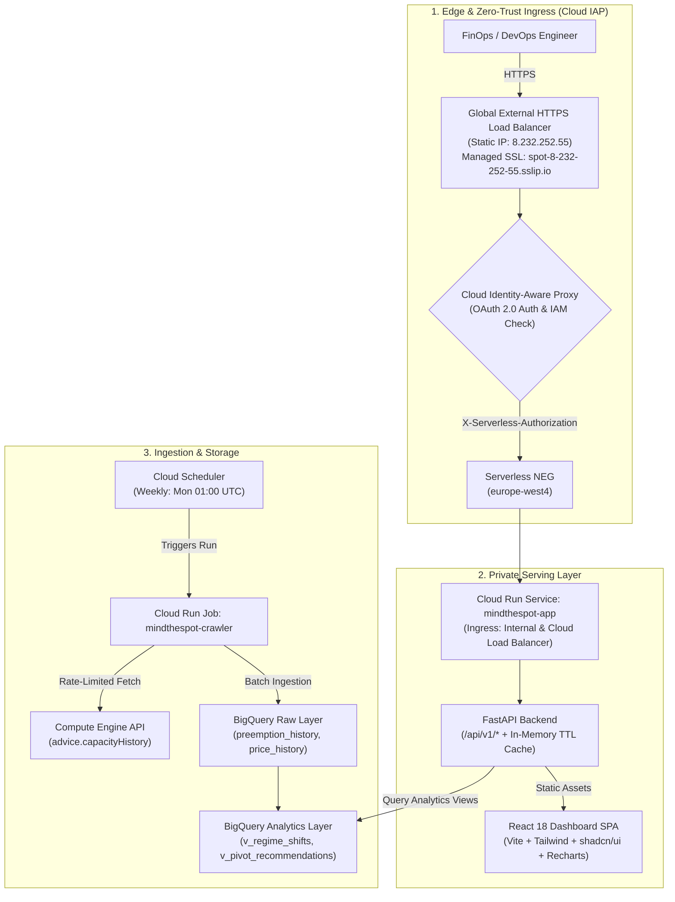

# MindTheSpot 🎯

> **GCP Spot VM Regime Shift Warning & Fallback Pivot Engine**

MindTheSpot is an internal FinOps and DevOps intelligence platform that automatically collects, analyzes, and visualizes Google Cloud Spot VM preemption rates and pricing telemetry.

Instead of passive telemetry, MindTheSpot acts as an **early-warning and decision engine**:
* **Regime Shift Detection:** Benchmarks rolling 7-day preemption metrics against a 30-day baseline to detect statistical volatility spikes ($Z \ge 2.5$) and alerts on discrete price increases ($\ge 10\%$).
* **Automated Pivot Recommendations:** Recommends alternative stable zones (same machine type) or equivalent machine families (e.g. `c3d` $\leftrightarrow$ `c4d` $\leftrightarrow$ `c4a`/Axion $\leftrightarrow$ `n2d`) when an active pool becomes congested.
* **Modern Operational Dashboard:** High-density React 18 + Tailwind CSS + shadcn/ui frontend with interactive Recharts time-series curves.
* **Zero-Trust Enterprise Architecture:** Protected by **Google Cloud Identity-Aware Proxy (IAP)** and a **Global External HTTPS Load Balancer** with automated Google-managed SSL.

---

## 🚀 Live Production Environment

MindTheSpot is running in production in Google Cloud project `jcf-mindthespot` (region `europe-west4`):

| Resource | Value / URI | Status |
| :--- | :--- | :--- |
| **Production URL** | [**`https://spot-8-232-252-55.sslip.io/`**](https://spot-8-232-252-55.sslip.io/) | **Active** (IAP Protected) |
| **Global Load Balancer** | `8.232.252.55` (Port 443 HTTPS, Port 80 HTTP Redirect) | **Active** |
| **Managed SSL Certificate** | Google-Managed (`spot-8-232-252-55.sslip.io`) | **Active** |
| **Authentication** | Google Cloud IAP (OAuth 2.0 via Google Workspace) | **Active** |
| **Backend Compute** | Cloud Run Service: `mindthespot-app` | Private (`INTERNAL_LOAD_BALANCER`) |
| **Scheduled Crawler** | Cloud Run Job: `mindthespot-crawler` (Weekly Cron) | **Active** |
| **Data Lakehouse** | BigQuery: `mindthespot_raw` & `mindthespot_analytics` | **Active** |

---

## 🏛️ System Architecture



---

## 🛠️ Local Development & Quickstart

### 1. Installation
```bash
# Clone the repository
git clone https://github.com/jcfesantieu-goog/mindthespot.git
cd mindthespot

# Set up Python environment
uv venv
source .venv/bin/activate
uv pip install -e ".[dev]"
```

### 2. Running Automated Tests
```bash
# Run pytest unit test suite (38 tests)
pytest -v

# Run Python linter & code formatting
ruff check .
```

### 3. Running the Crawler Locally
```bash
# Dry-run crawl with terminal summary (no GCP write)
mindthespot crawl --dry-run

# Ingest into BigQuery
mindthespot crawl --output=bigquery --project=jcf-mindthespot --dataset=mindthespot_raw
```

### 4. Running the Dashboard Locally
```bash
# Production server (serves FastAPI + compiled React frontend on port 8080)
mindthespot serve --port 8080

# Or run Vite frontend dev server with hot reload
cd frontend && npm install && npm run dev
```

---

## ⚙️ Infrastructure as Code (Terraform) & GitOps

All cloud infrastructure is declared in `terraform/` and managed through continuous GitOps in GitHub Actions:

### Key Terraform Components
* **`terraform/load_balancer.tf`:** Global external IPv4 address, Serverless NEG, Backend Service with IAP, Managed SSL Certificate, and URL Maps with HTTP $\rightarrow$ HTTPS redirection.
* **`terraform/iap.tf`:** IAP access IAM bindings and IAP Service Agent `roles/run.invoker` permission on Cloud Run.
* **`terraform/cloud_run.tf`:** Production Cloud Run Service with private perimeter (`INGRESS_TRAFFIC_INTERNAL_LOAD_BALANCER`) and custom audiences.
* **`terraform/bigquery.tf`:** Daily partitioned datasets (`mindthespot_raw`) and real-time analytical views (`mindthespot_analytics`).
* **`terraform/iam.tf`:** Workload Identity Federation (WIF) setup for GitHub Actions and least-privilege service accounts.

### GitOps Pipelines (`.github/workflows/`)
* **`ci.yml`:** Automated pre-flight checks on pull requests (Python unit tests, React build, and Terraform format checks).
* **`terraform-plan.yml`:** Runs speculative terraform plan and comments on pull requests.
* **`gitops.yml`:** Triggered on push to `main`:
  1. Executes pre-flight verification gates (Python tests + Vite production build).
  2. Authenticates to Google Cloud using **Workload Identity Federation (WIF)** (zero static keys).
  3. Builds and pushes multi-stage container image to Artifact Registry.
  4. Automatically injects `IAP_CLIENT_ID` and `IAP_CLIENT_SECRET` from repository secrets and runs `terraform apply`.

---

## 📚 Technical Specifications & Architectural Decisions

* **[SPEC.md](SPEC.md):** Complete technical specifications, BigQuery DDL, REST API schemas, mathematical Z-score formulas, and machine family equivalence matrices.
* **[ADR 001: Cloud IAP & Load Balancer](docs/adr/001-cloud-iap-load-balancer-sslip.md):** Architecture Decision Record detailing Domain Restricted Sharing (DRS) resolution, dynamic `sslip.io` DNS, and zero-trust authentication.
