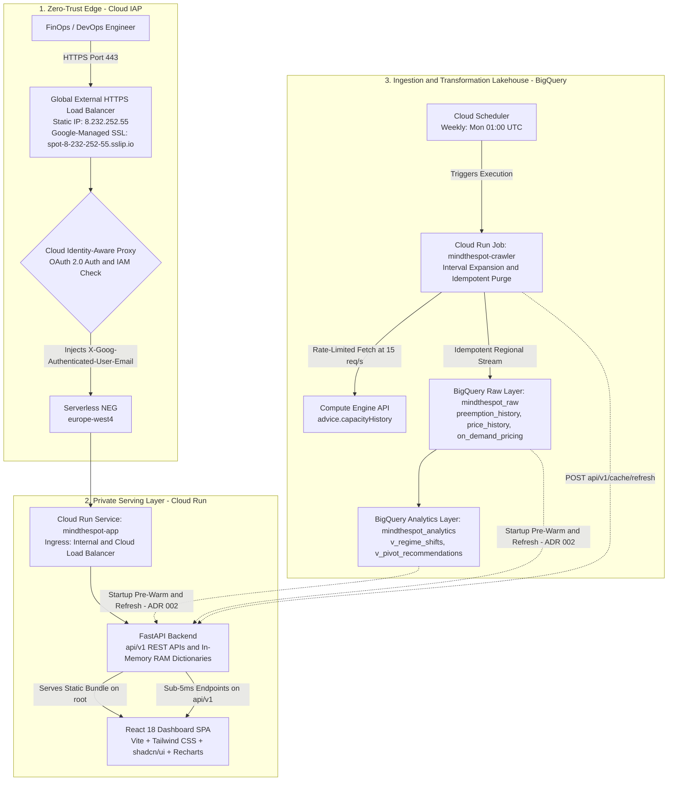

# MindTheSpot 🎯

> **GCP Spot VM Regime Shift Early-Warning & Fallback Pivot Engine**

MindTheSpot is an internal FinOps and DevOps intelligence platform that continuously analyzes, forecasts, and visualizes Google Cloud Spot VM preemption rates and pricing telemetry across 43 regions.

Instead of passive telemetry or slow ad-hoc dashboards, MindTheSpot acts as an **early-warning system and automated decision engine**:
* **Statistical Regime Shift Detection:** Benchmarks rolling 7-day preemption metrics against a 23-day historical baseline to detect statistical volatility spikes ($Z \ge 2.5\sigma$) and alerts on discrete spot price increases ($\ge 10\%$).
* **Automated Pivot Recommendations:** Recommends stable sibling zones (same machine type, rate $\le 5\%$, $Z < 1.0$) or hardware-equivalent families (e.g. `c3d` $\leftrightarrow$ `c4d` $\leftrightarrow$ `c4a`/Axion $\leftrightarrow$ `n2d`) when an active pool becomes congested.
* **Spot vs. On-Demand Arbitrage:** Compares real-time spot rates against public Google Cloud list prices stored in BigQuery, displaying live spot discounts ($30\%\text{--}80\%$) across instance cards, historical charts, and the pool explorer.
* **Multi-Watchlist & Workload Management (ADR 003):** Create, track, and filter named workload watchlists (e.g. data pipelines, ML clusters) in the Situation Room with real-time critical/elevated anomaly counters, dual-layer client/server persistence, and modal management.
* **Natural Deterministic Sorting:** Pool Explorer provides natural numeric sorting for machine types (e.g. `c4a-standard-2`, `4`, `16`, `32`) with multi-column tie-breakers for predictable pagination.
* **Hybrid In-Memory Serving (ADR 002):** Pre-warms 4,000+ pools and 140,000+ telemetry points into RAM upon container startup, serving all dashboard traffic in $< 5\text{ ms}$ with zero BigQuery slot consumption.
* **Zero-Trust Enterprise Edge:** Protected by **Google Cloud Identity-Aware Proxy (IAP)** and a **Global External HTTPS Load Balancer** with automated Google-managed SSL via `sslip.io`.

---

## 🚀 Live Production Environment

MindTheSpot is deployed in Google Cloud Argolis project `jcf-mindthespot` (region `europe-west4`):

| Resource | Value / URI | Status |
| :--- | :--- | :--- |
| **Production URL** | [**`https://spot-8-232-252-55.sslip.io/`**](https://spot-8-232-252-55.sslip.io/) | **Active** (IAP Protected) |
| **Global Load Balancer** | `8.232.252.55` (HTTPS :443, HTTP :80 301 Redirect) | **Active** (`EXTERNAL_MANAGED`) |
| **Managed SSL Certificate** | Google-Managed (`spot-8-232-252-55.sslip.io`) | **Active** (Google Trust Services CA) |
| **Authentication** | Google Cloud IAP (OAuth 2.0 via Google Workspace) | **Active** (Enforces Argolis Domain IAM) |
| **Backend Compute** | Cloud Run Service: `mindthespot-app` | Private (`INTERNAL_LOAD_BALANCER`) |
| **Scheduled Crawler** | Cloud Run Job: `mindthespot-crawler` (Weekly Cron) | **Active** (15-Worker Queue, $< 120\text{ MB}$ RAM) |
| **Data Lakehouse** | BigQuery: `mindthespot_raw` & `mindthespot_analytics` | **Active** (4,057 Pools, 120k+ Preemption Points) |

---

## 🏛️ System Architecture



---

## 🔬 Core Analytics & Detection Logic

### 1. Statistical Regime Shift Engine (`v_regime_shifts`)
* **Recent Window ($d_1 \dots d_7$)**: Mean preemption rate $\mu_{7d}$.
* **Baseline Window ($d_8 \dots d_{30}$)**: Mean baseline rate $\mu_{\text{base}}$ and sample standard deviation $\sigma_{\text{base}}$.
* **Normalized Volatility Metric**:
  $$Z = \frac{\mu_{7d} - \mu_{\text{base}}}{\max(\sigma_{\text{base}}, 0.02)}$$
* **Alert Thresholds**:
  * `CRITICAL`: $Z \ge 2.5\sigma$ OR Rate Delta $\Delta \ge 15.0\%$ OR Recent Price Hike $\ge 10\%$.
  * `ELEVATED`: $1.5\sigma \le Z < 2.5\sigma$ OR $7.5\% \le \Delta < 15.0\%$.
  * `STABLE`: Nominal operating variance.

### 2. On-Demand vs. Spot Arbitrage
* Raw compute list prices are stored in `mindthespot_raw.on_demand_pricing`.
* Spot discount percentages are calculated in real time:
  $$\text{Discount \%} = \frac{\text{OnDemand Hourly} - \text{Current Spot Hourly}}{\text{OnDemand Hourly}} \times 100$$

### 3. Contiguous Calendar Day Expansion
* The Google Compute Engine Capacity History API compresses contiguous days with identical rates into $[startTime, endTime)$ intervals.
* The MindTheSpot crawler unrolls each interval into discrete `DailyPreemptionRate` records across all individual calendar days, eliminating false volatility alerts caused by missing data points.

---

## 🛠️ Local Development & Quickstart

### 1. Installation & Environment Setup
```bash
# Clone the repository
git clone https://github.com/jcfesantieu-goog/mindthespot.git
cd mindthespot

# Set up Python virtual environment
python3 -m venv .venv
source .venv/bin/activate
pip install -e ".[dev]"

# Install frontend dependencies
npm --prefix frontend install
```

### 2. Mandatory Pre-Flight Verification Gates
Run all three quality gates before committing code or pushing:
```bash
# Gate 1: Python Linting & Formatting
./.venv/bin/ruff check .

# Gate 2: Automated Test Suite (52 tests)
./.venv/bin/pytest tests/

# Gate 3: Frontend TypeScript & Production Build
npm --prefix frontend run build
```

### 3. Running Services Locally
```bash
# Run standalone FastAPI backend in dev mode (http://localhost:8000)
./.venv/bin/python -m mindthespot.cli api --port 8000 --reload

# Run frontend dev server with Vite hot reload (http://localhost:5173, proxies /api -> :8000)
cd frontend && npm run dev

# Run unified production server (serves FastAPI + compiled React UI on single port)
./.venv/bin/python -m mindthespot.cli serve --port 8080

# Execute dry-run crawler test
./.venv/bin/python -m mindthespot.cli crawl --dry-run --regions europe-west4

# Seed public on-demand pricing matrix to BigQuery
./.venv/bin/python -m mindthespot.cli seed-pricing --project jcf-mindthespot --dataset mindthespot_raw
```

---

## ⚙️ Infrastructure as Code (Terraform) & GitOps

All cloud infrastructure is declared in `terraform/` and deployed through continuous GitOps in GitHub Actions:

### Terraform Modules
* **`terraform/load_balancer.tf`:** Global external IPv4 address, Serverless NEG, Backend Service with IAP, Managed SSL Certificate, and URL Maps with HTTP $\rightarrow$ HTTPS 301 redirection.
* **`terraform/cloud_run.tf`:** Cloud Run Service (`mindthespot-app`) locked to `INGRESS_TRAFFIC_INTERNAL_LOAD_BALANCER` and Cloud Run Job (`mindthespot-crawler`).
* **`terraform/bigquery.tf`:** Daily partitioned tables (`preemption_history`, `price_history`, `on_demand_pricing`) and analytical views (`v_regime_shifts`, `v_pivot_recommendations`).
* **`terraform/iam.tf`:** Workload Identity Federation (WIF) setup for GitHub Actions, IAP accessor bindings, and `roles/run.invoker` for the IAP Service Agent.

### GitOps Pipeline (`.github/workflows/gitops.yml`)
Triggered automatically on pushes to `main`:
1. **Pre-flight Quality Gates**: Runs `ruff check .`, `pytest tests/` (52 tests), and `npm run build`.
2. **Workload Identity Federation**: Authenticates to Google Cloud via keyless OIDC tokens.
3. **Container Build**: Compiles multi-stage Docker image and pushes to Google Artifact Registry.
4. **Terraform Apply**: Applies declarative changes with remote state stored in `gs://jcf-mindthespot-tfstate`.

---

## 📚 Technical Documentation & Records

* **[GEMINI.md](GEMINI.md):** AI context guidelines, operational principles, anti-patterns, and environment variables.
* **[SPEC.md](SPEC.md):** Full technical specifications, BigQuery schemas, REST API specs, and mathematical formulas.
* **[issue.md](issue.md):** Incident post-mortems (OOM crawler fix, interval expansion, and synthetic fallback resolution).
* **[ADR 001: Cloud IAP & Load Balancer](docs/adr/001-cloud-iap-load-balancer-sslip.md):** Architecture Decision Record detailing Domain Restricted Sharing (DRS), dynamic `sslip.io` DNS, and zero-trust authentication.
* **[ADR 002: In-Memory Pre-Warming & Background Sync](docs/adr/002-hybrid-prewarm-background-sync-caching.md):** Architecture Decision Record detailing sub-5ms serving and BigQuery slot optimization.
* **[ADR 003: Dual-Layer Watchlist & Fallback Pivots](docs/adr/003-dual-layer-watchlist-and-prioritized-fallback-pivots.md):** Architecture Decision Record detailing dual-layer client/server watchlist sync, 3-tier fallback matching, and multi-watchlist management.
