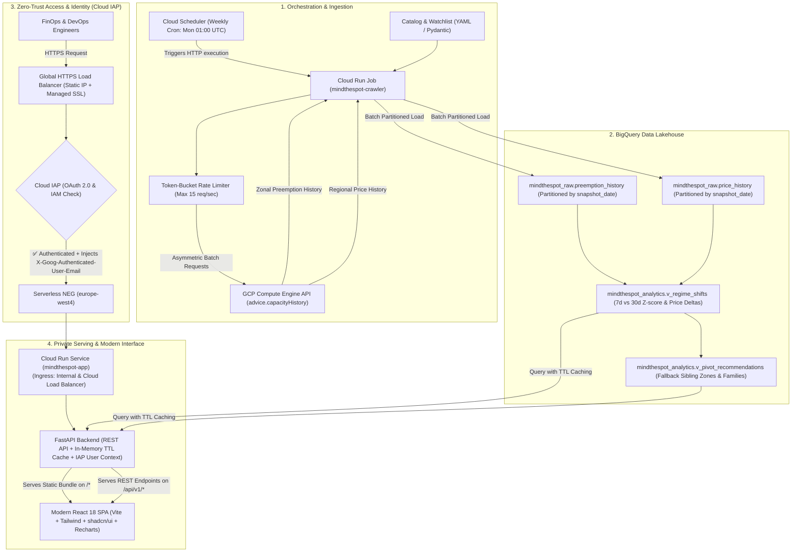

# Capability Map: MindTheSpot

| Module ID | Responsibility | Depends On |
|---|---|---|
| `core-config` | Catalog definition (curated machine types, regions, zones) and custom watchlist schema/validation | — |
| `crawler` | Async GCP Compute API client (`advice.capacityHistory`), rate limiting, retries, and data extraction | `core-config` |
| `storage-analytics` | BigQuery DDL/schemas, idempotent partition writes, analytical views (Z-score calculation, price step detection, pivot matching) | `core-config`, `crawler` |
| `api` | FastAPI backend service exposing BigQuery analytics, historical curves, and pivot recommendations with caching | `storage-analytics` |
| `web-ui` | Modern React/TypeScript frontend (Vite, Tailwind CSS, shadcn/ui, Lucide, Recharts) featuring Situation Room, Explorer, and Pivot cards | `api` |
| `cli` | Unified command-line interface (`mindthespot crawl`, `mindthespot serve`, `mindthespot analyze`) | `crawler`, `storage-analytics`, `api` |

**Build Order:** `core-config` → `crawler` → `storage-analytics` → `api` → `web-ui` → `cli`

---

# Spec: MindTheSpot — GCP Spot Regime Shift & Pivot Engine

## 1. Objective

MindTheSpot is an internal FinOps and DevOps intelligence platform that automatically collects, analyzes, and visualizes Google Cloud Spot VM preemption rates and pricing telemetry. 

Instead of passive telemetry or slow generic dashboards, MindTheSpot acts as an **early-warning and decision engine** with a **state-of-the-art modern web interface**:
1. **Regime Shift Detection:** Benchmarks rolling 7-day preemption metrics against a 30-day baseline to detect statistical volatility spikes ($Z \ge 2.5$) and alerts on discrete price increases ($\ge 10\%$).
2. **Automated Pivot Recommendations:** Recommends alternative stable zones (same machine type) or equivalent machine families (e.g. `c3d` $\leftrightarrow$ `c4d` $\leftrightarrow$ `c4a`/Axion $\leftrightarrow$ `n2d`) when an active pool becomes congested.
3. **Targeted Coverage:** Combines an opinionated default catalog of modern compute/general instance families across major enterprise regions with a customizable team watchlist.
4. **Modern High-Density UI:** Replaces clumsy legacy data UI tools with a fast, modern React + Tailwind CSS + shadcn/ui frontend designed for operational clarity.

### Target Personas & Primary Use Cases
* **Platform / DevOps Engineers:** Consult before scheduling long-running batch workloads or sizing GKE Spot nodepools to prevent mid-job evictions.
* **FinOps Practitioners:** Track spot price hikes and discover cheaper equivalent families (e.g., migrating compute-bound tasks to Axion or C4D).

---

## 2. Technical Architecture

### 2.1 System Architecture Overview

MindTheSpot is structured as a cloud-native, decoupled system separating asynchronous ingestion from read-optimized analytical querying and secure zero-trust frontend presentation.



---

### 2.2 Subsystem Descriptions

#### 1. Ingestion Subsystem (Crawler & Scheduler)
* **Execution Model:** Runs serverless as a **Cloud Run Job**, invoked on a weekly schedule by **Cloud Scheduler** (e.g., every Monday at 01:00 UTC, safely after Google Cloud's midnight Pacific Time telemetry rollover).
* **Asymmetric Query Mechanics:**
  * **Preemption Telemetry:** Zonal granularity (`locationPolicy.location: "zones/{zone}"`). GCP returns 30 rolling daily values (`0.00` to `1.00`).
  * **Price Telemetry:** Regional granularity (`regions/{region}`). GCP returns 1-year historical hourly prices per active interval.
* **Rate Limiting & Resiliency:**
  * A client-side Token Bucket Rate Limiter restricts outgoing requests to $\le 15\text{ req/s}$ (well within Compute Engine Advice API quotas).
  * Jittered exponential backoff handles any transient `429 Too Many Requests` or `503 Service Unavailable` errors.
  * Concurrency is managed via `asyncio.Semaphore` with connection reuse via HTTP/2 connection pooling (`httpx.AsyncClient`).

#### 2. Storage & Analytical Transformation Subsystem (BigQuery)
* **Raw Lakehouse Layer (`mindthespot_raw`):**
  * Tables are partitioned daily by `snapshot_date` (`DATE`) and clustered by `region`, `zone`, and `machine_type`.
  * Ingestion is append-only per weekly run. Weekly runs are idempotent: inserting a new snapshot partition does not touch or invalidate historical partitions.
* **Analytical Transformation Layer (`mindthespot_analytics`):**
  * BigQuery SQL Views continuously compute rolling statistical metrics on demand without expensive manual batch pipelines:
    * `v_regime_shifts`: Computes baseline mean $\mu_{\text{base}}$ ($d_1 \dots d_{23}$), recent mean $\mu_{7d}$ ($d_{24} \dots d_{30}$), variance $\sigma_{\text{base}}$, and Z-score $Z = \frac{\mu_{7d} - \mu_{\text{base}}}{\max(\sigma_{\text{base}}, 0.02)}$. Also detects discrete price interval shifts ($\Delta_{\text{price}} \ge 10\%$).
    * `v_pivot_recommendations`: Cross-joins anomaly pools with candidate stable pools in the same region, evaluating latency proximity (sibling zones) and hardware equivalence (same vCPU/RAM envelope across C4D, C3D, C4A, N2D).

#### 3. Identity-Aware Proxy & Edge Ingress Subsystem (Cloud IAP)
* **Zero-Trust Access Model:**
  * Public HTTPS traffic terminates at a **Global External Application Load Balancer** (`EXTERNAL_MANAGED`) backed by a dedicated static Anycast IPv4 address (`8.232.252.55`).
  * Features a permanent HTTP $\rightarrow$ HTTPS 301 redirection URL map (Port 80 $\rightarrow$ 443).
  * Leverages dynamic wildcard DNS via `sslip.io` (`spot-${replace(local.lb_ip, ".", "-")}.sslip.io` $\rightarrow$ `https://spot-8-232-252-55.sslip.io`), paired with an automated **Google-Managed SSL Certificate** issued and renewed by Google Trust Services CA without manual DNS intervention.
  * Ingress traffic is intercepted by **Google Cloud Identity-Aware Proxy (IAP)**, enforcing OAuth 2.0 corporate authentication against Google Workspace / Cloud Identity domains.
  * Access is strictly controlled via IAM role `roles/iap.httpsResourceAccessor` granted to authorized domains (e.g. `domain:jcfesantieu.altostrat.com`) and specific engineering users (`user:sre@jcfesantieu.altostrat.com`).
* **Private Compute Protection (DRS-Compliant):**
  * The Cloud Run service enforces `ingress = "INGRESS_TRAFFIC_INTERNAL_LOAD_BALANCER"`. Direct internet traffic to `*.a.run.app` is blocked at the network perimeter.
  * Traffic reaches Cloud Run exclusively via a regional **Serverless Network Endpoint Group (NEG)** attached to the backend service.
  * Because organizational policy enforces Domain Restricted Sharing (`constraints/iam.allowedPolicyMemberDomains`), `allUsers` cannot be bound to Cloud Run. Instead, the **IAP Service Agent** (`serviceAccount:service-${PROJECT_NUMBER}@gcp-sa-iap.iam.gserviceaccount.com`) is granted `roles/run.invoker` on Cloud Run.
  * IAP attaches a signed OIDC token in `X-Serverless-Authorization` which Cloud Run validates before stripping.
  * Cloud Run declares `custom_audiences` (`https://${local.effective_domain}` and `var.iap_client_id`) to ensure token audience alignment.
* **User Context Propagation:**
  * IAP injects cryptographically signed headers into upstream HTTP requests:
    * `X-Goog-Authenticated-User-Email`: e.g. `accounts.google.com:sre@jcfesantieu.altostrat.com`
    * `X-Goog-Authenticated-User-Id`: Unique Google identity identifier
    * `X-Goog-IAP-JWT-Assertion`: Signed JWT verifiable using Google's public keys
  * The FastAPI backend inspects these headers (e.g. `/api/v1/auth/me`) to provide user attribution, personalized watchlist preferences, and security auditability without requiring complex application-level OAuth flows.

#### 4. Backend Serving Subsystem (FastAPI)
* **API Gateway & Service Layer:**
  * Built with **FastAPI** running on Uvicorn. Exposes typed OpenAPI JSON specs and interactive `/docs`.
  * Implements an in-memory TTL query cache (`cachetools.TTLCache`, 15-minute expiration) for BigQuery query results to prevent redundant query scans and cost during high dashboard traffic.
* **Single-Container Deployment:**
  * FastAPI mounts the compiled React production bundle (`frontend/dist`) at the root `/` and serves dynamic REST APIs under `/api/v1/*`.
  * Catches unhandled routes to return `index.html` for client-side HTML5 history routing.

#### 5. Modern Frontend Subsystem (React + Vite + shadcn/ui)
* **Component Architecture:**
  * **Situation Room:** High-density, real-time alert feed displaying active `CRITICAL`, `ELEVATED`, and `PRICE HIKE` badges.
  * **Pool Explorer:** Region, zone, and family selectors with interactive Recharts time-series graphs featuring threshold reference lines ($20\%$, $50\%$) and moving average trends.
  * **Pivot Comparison Drawer:** 1-click comparison card showing immediate fallback options with expected preemption savings and cost deltas.
  * **Watchlist Manager:** Seamless toggle between the organization's custom tracked pools and the global default catalog.

---

### 2.3 Security, IAM & Infrastructure Boundaries

* **Principle of Least Privilege (PoLP):**
  * **Crawler Identity:** Dedicated GCP Service Account (`mindthespot-crawler@<project>.iam.gserviceaccount.com`) assigned only:
    * `roles/compute.viewer` (grants `compute.advice.capacityHistory` permission).
    * `roles/bigquery.dataEditor` (scoped to `mindthespot_raw` dataset).
  * **Dashboard/API Identity:** Dedicated GCP Service Account (`mindthespot-app@<project>.iam.gserviceaccount.com`) assigned only:
    * `roles/bigquery.dataViewer` (scoped to `mindthespot_analytics` dataset).
    * `roles/bigquery.jobUser` (permission to run analytical queries).
* **Zero Static Secrets & Keyless CI/CD:**
  * No service account JSON keys or API keys stored on disk or in repository.
  * GitHub Actions uses **Workload Identity Federation (WIF)** OIDC tokens for automated deployment.
  * Cloud Run workloads authenticate automatically via metadata server Workload Identity.
* **Network & Ingress Security:**
  * Cloud Run ingress is restricted to `INGRESS_TRAFFIC_INTERNAL_LOAD_BALANCER` behind **Google Cloud Identity-Aware Proxy (IAP)**, guaranteeing full compatibility with Domain Restricted Sharing (`constraints/iam.allowedPolicyMemberDomains`) policies.

---

## 3. Tech Stack & Dependencies

### Backend & Data Pipeline
* **Language & Runtime:** Python 3.11+
* **Package Management:** `uv` (recommended) or `pip` / `venv` with `pyproject.toml`
* **Core Libraries:**
  * `google-auth`, `google-api-python-client`, `httpx` (HTTP/2 async requests with rate limiting)
  * `google-cloud-bigquery` (partitioned dataset ingestion and querying)
  * `pydantic` >= 2.6, `pydantic-settings` (data contracts and environment configuration)
  * `fastapi` >= 0.110, `uvicorn` >= 0.28 (REST API serving analytical views and static assets)
  * `cachetools` >= 5.3 (in-memory TTL caching for BigQuery query results)
  * `typer` >= 0.12 (CLI entrypoints)
* **Testing & Quality:** `pytest`, `pytest-asyncio`, `pytest-mock`, `ruff`

### Frontend UI
* **Framework:** React 18+ with TypeScript
* **Build Tool:** Vite 5+ (instant HMR, fast production bundling)
* **Styling & Components:**
  * Tailwind CSS 3.4+
  * `shadcn/ui` (accessible Radix UI primitives: Cards, Badges, Tabs, Dialogs, Selects, Tooltips)
  * `lucide-react` (icons)
* **Visualizations & Charts:**
  * `recharts` >= 2.12 (interactive, responsive time-series preemption curves & price step-charts)
* **Data Fetching:** TanStack React Query v5 (client-side caching, polling, and revalidation)

---

## 4. Commands

```bash
# -------------------------------------------------------------
# 1. Environment & Backend Setup
# -------------------------------------------------------------
uv venv
source .venv/bin/activate
uv pip install -e ".[dev]"

# Code quality
ruff check . --fix
ruff format .

# Unit & Integration Tests
pytest -v --cov=mindthespot --cov-report=term-missing

# -------------------------------------------------------------
# 2. Frontend Setup & Local Development
# -------------------------------------------------------------
cd frontend
npm install
npm run dev           # Runs Vite dev server on http://localhost:5173 (proxies /api to :8000)
npm run build         # Builds production bundle to frontend/dist

# -------------------------------------------------------------
# 3. Running Services & CLI
# -------------------------------------------------------------
# Run crawler locally
mindthespot crawl --dry-run
mindthespot crawl --output=bigquery --project=my-gcp-project --dataset=mindthespot

# Run standalone FastAPI backend in dev mode
mindthespot api --port 8000 --reload

# Run unified production server (serves FastAPI + compiled React frontend on single port)
mindthespot serve --port 8080

# Run quick terminal anomaly analysis
mindthespot analyze --region europe-west4 --family c4d
```

---

## 5. Project Structure

```
mindthespot/
├── pyproject.toml                     # Python dependencies, build system, tool configurations
├── README.md                          # Quickstart, setup, and architecture overview
├── docs/
│   ├── ideas/
│   │   └── mindthespot.md             # Initial ideation one-pager
│   └── spec/
│       └── SPEC.md                    # Authoritative specification
├── config/
│   ├── default_catalog.yaml           # Curated regions, zones, and default instance families
│   └── watchlist.example.yaml         # Sample user-defined custom watchlist
├── sql/
│   ├── ddl/
│   │   ├── 01_raw_preemption_history.sql # BigQuery raw table for daily preemption rates
│   │   └── 02_raw_price_history.sql      # BigQuery raw table for interval pricing
│   └── views/
│       ├── 01_v_regime_shifts.sql        # View calculating 7d vs 30d baseline & Z-scores
│       └── 02_v_pivot_recommendations.sql# View joining anomaly pools with stable alternatives
├── mindthespot/
│   ├── __init__.py
│   ├── cli.py                         # Typer CLI entrypoint
│   ├── config/
│   │   ├── __init__.py
│   │   ├── loader.py                  # Catalog & watchlist parser with Pydantic models
│   │   └── models.py                  # CatalogConfig, WatchlistConfig models
│   ├── crawler/
│   │   ├── __init__.py
│   │   ├── client.py                  # Async client for compute.advice.capacityHistory
│   │   ├── rate_limiter.py            # Token bucket / concurrency limiter (15 req/sec max)
│   │   ├── extractor.py               # Orchestrator: iterating catalog/watchlist targets
│   │   └── models.py                  # API request/response Pydantic models
│   ├── storage/
│   │   ├── __init__.py
│   │   ├── bigquery_client.py         # Partitioned batch ingestion into BigQuery
│   │   └── schemas.py                 # Schema definitions matching DDL
│   ├── analytics/
│   │   ├── __init__.py
│   │   ├── statistical.py             # Python fallback/test implementation of Z-score & spikes
│   │   └── pivot_rules.py             # Equivalent family mapping matrix
│   └── api/                           # FastAPI backend
│       ├── __init__.py
│       ├── main.py                    # App init, CORS, and static mount for frontend
│       ├── service.py                 # BigQuery reader with in-memory TTL caching
│       └── routes/
│           ├── anomalies.py           # GET /api/v1/anomalies
│           ├── pools.py               # GET /api/v1/pools and /pools/{r}/{z}/{m}/history
│           ├── pivots.py              # GET /api/v1/pivots/{r}/{z}/{m}
│           └── watchlist.py           # GET /api/v1/watchlist
├── frontend/                          # Modern React + Vite + Tailwind + shadcn/ui
│   ├── package.json
│   ├── tsconfig.json
│   ├── vite.config.ts                 # Dev server with proxy to FastAPI :8000
│   ├── tailwind.config.ts
│   └── src/
│       ├── main.tsx
│       ├── App.tsx                    # Shell layout (Navbar, Status Pill, Theme Toggle)
│       ├── types/
│       │   └── index.ts               # TypeScript interfaces matching API models
│       ├── lib/
│       │   ├── api.ts                 # Typed fetch client
│       │   └── utils.ts               # Classnames (cn) & formatters
│       ├── hooks/
│       │   ├── useAnomalies.ts        # React Query hook for regime shifts
│       │   └── usePoolHistory.ts      # React Query hook for preemption/price history
│       └── components/
│           ├── ui/                    # shadcn/ui components (card, badge, button, tabs, dialog)
│           ├── SituationRoom.tsx      # High-density regime shift alert feed
│           ├── AnomalyCard.tsx        # Card with Z-score badge, delta pill, and quick pivot CTA
│           ├── PoolExplorer.tsx       # Region / Family / Zone filter bar & grid
│           ├── PreemptionChart.tsx    # Recharts 30-day preemption curve with threshold reference lines
│           ├── PriceTimeline.tsx      # Step-function historical price timeline
│           ├── PivotModal.tsx         # Interactive fallback comparison drawer/dialog
│           └── WatchlistToggle.tsx    # Filter between "All Pools" and "My Watchlist"
├── terraform/                         # Declarative Infrastructure as Code (GCP)
│   ├── versions.tf                    # Google & Google-Beta providers, GCS backend
│   ├── variables.tf                   # Variables with defaults (IAP, domain, regions, quotas)
│   ├── apis.tf                        # Enabled GCP APIs (run, compute, iap, bigquery, scheduler)
│   ├── load_balancer.tf               # Global HTTPS Load Balancer, Serverless NEG, Managed SSL
│   ├── iap.tf                         # IAP access policy & IAP service identity invoker binding
│   ├── cloud_run.tf                   # Cloud Run Service (FastAPI + React) & Job (Crawler)
│   ├── cloud_scheduler.tf             # Weekly cron trigger targeting Cloud Run Job
│   ├── bigquery.tf                    # Raw partitioned tables & analytics SQL views
│   ├── artifact_registry.tf           # Docker repository for container images
│   ├── iam.tf                         # PoLP Service Accounts & Workload Identity Federation
│   └── outputs.tf                     # Load Balancer IP, sslip.io FQDN, WIF provider name
├── .github/workflows/                 # Continuous Integration & GitOps Pipelines
│   ├── ci.yml                         # Automated PR tests (Pytest + Vite build + Terraform fmt)
│   ├── terraform-plan.yml             # Speculative Terraform plan on PRs via WIF
│   └── gitops.yml                     # Production GitOps deployment on push to main
└── tests/
    ├── conftest.py                    # Mock fixtures for GCP API responses
    ├── test_config.py                 # Test catalog and custom watchlist validation
    ├── test_crawler.py                # Test rate limiting, retries, and API parsing
    ├── test_analytics.py              # Test Z-score math, threshold triggers, pivot logic
    ├── test_api.py                    # Test FastAPI route responses with mock BigQuery service
    ├── test_cli.py                    # Test CLI commands and options
    └── test_bigquery_storage.py       # Test payload formatting and idempotent writes
```

---

## 6. Architectural Contracts & Interfaces

### 6.1 GCP Compute Capacity History API Contract
* **Zonal Preemption Endpoint:**
  `POST https://compute.googleapis.com/compute/beta/projects/{project}/regions/{region}/advice/capacityHistory`
  Payload:
  ```json
  {
    "types": ["PREEMPTION"],
    "instanceProperties": {
      "scheduling": { "provisioningModel": "SPOT" },
      "machineType": "c4d-standard-8"
    },
    "locationPolicy": {
      "location": "zones/europe-west4-a"
    }
  }
  ```
* **Regional Price Endpoint:**
  `POST https://compute.googleapis.com/compute/beta/projects/{project}/regions/{region}/advice/capacityHistory`
  Payload:
  ```json
  {
    "types": ["PRICE"],
    "instanceProperties": {
      "scheduling": { "provisioningModel": "SPOT" },
      "machineType": "c4d-standard-8"
    }
  }
  ```

### 6.2 BigQuery Storage Schemas
1. **`mindthespot_raw.preemption_history`**:
   - `snapshot_date`: DATE (Partitioning column)
   - `crawled_at`: TIMESTAMP
   - `region`: STRING
   - `zone`: STRING
   - `machine_type`: STRING
   - `interval_start`: TIMESTAMP
   - `interval_end`: TIMESTAMP
   - `preemption_rate`: FLOAT64 (0.0 to 1.0)
   *Clustered by:* `region, zone, machine_type`

2. **`mindthespot_raw.price_history`**:
   - `snapshot_date`: DATE (Partitioning column)
   - `crawled_at`: TIMESTAMP
   - `region`: STRING
   - `machine_type`: STRING
   - `interval_start`: TIMESTAMP
   - `interval_end`: TIMESTAMP
   - `currency`: STRING (e.g. "USD")
   - `hourly_price`: FLOAT64 (`nanos / 1e9`)
   *Clustered by:* `region, machine_type`

### 6.3 FastAPI REST API Contracts
* **`GET /api/v1/anomalies`**
  Returns active regime shifts sorted by severity score.
  ```json
  [
    {
      "region": "europe-west4",
      "zone": "europe-west4-a",
      "machine_type": "c4d-standard-16",
      "family": "c4d",
      "severity": "CRITICAL",
      "z_score": 3.42,
      "recent_7d_rate": 0.38,
      "baseline_30d_rate": 0.04,
      "delta": 0.34,
      "price_hourly": 0.1824,
      "price_status": "STABLE",
      "is_watchlist": true
    }
  ]
  ```
* **`GET /api/v1/pools/{region}/{zone}/{machine_type}/history`**
  Returns 30-day preemption points and 1-year price change intervals.
* **`GET /api/v1/pivots/{region}/{zone}/{machine_type}`**
  Returns top alternative candidates:
  * Zone Pivot (same machine type in sibling zone with low preemption)
  * Family Pivot (equivalent vCPU/RAM in same region with lower cost and volatility)

### 6.4 Mathematical Anomaly Detection Rules
* **Preemption Rolling Metrics:**
  * Sample size: 30 daily data points ($d_1, \dots, d_{30}$).
  * Baseline ($d_1 \dots d_{23}$): $\mu_{\text{base}}, \sigma_{\text{base}} = \max(\text{stddev}, 0.02)$.
  * Recent window ($d_{24} \dots d_{30}$): $\mu_{7d}$.
  * Metric: $Z = \frac{\mu_{7d} - \mu_{\text{base}}}{\sigma_{\text{base}}}$.
* **Severity Levels:**
  * `CRITICAL`: ($Z \ge 2.5$ AND $\mu_{7d} \ge 0.20$) OR ($\mu_{7d} - \mu_{\text{base}} \ge 0.25$) OR ($\mu_{7d} \ge 0.50$).
  * `ELEVATED`: ($Z \ge 1.8$ AND $\mu_{7d} \ge 0.15$) OR ($\mu_{7d} - \mu_{\text{base}} \ge 0.15$).
  * `STABLE`: All other pools.
* **Price Step-Change:**
  * $\Delta_{\text{price}} = \frac{P_{\text{current}} - P_{\text{previous}}}{P_{\text{previous}}}$.
  * If $\Delta_{\text{price}} \ge +0.10$ (+10%), flag `PRICE_HIKE`.

### 6.5 Family Pivot Equivalence Matrix
* **Compute-Optimized (AMD):** `c4d-standard-*` $\leftrightarrow$ `c3d-standard-*`
* **Compute-Optimized (Intel):** `c3-standard-*` $\leftrightarrow$ `c2-standard-*`
* **Arm / Axion:** `c4a-standard-*` (interchangeable for multi-arch containerized workloads)
* **General Purpose:** `n2d-standard-*` $\leftrightarrow$ `n2-standard-*` $\leftrightarrow$ `e2-standard-*`

---

## 7. Code Style & Representative Patterns

### 7.1 FastAPI Endpoint Pattern
```python
from fastapi import APIRouter, Depends, Query
from pydantic import BaseModel
from mindthespot.api.service import AnalyticsService, get_analytics_service

router = APIRouter(prefix="/api/v1", tags=["anomalies"])

class AnomalyItem(BaseModel):
    region: str
    zone: str
    machine_type: str
    family: str
    severity: str
    z_score: float
    recent_7d_rate: float
    baseline_30d_rate: float
    price_hourly: float
    is_watchlist: bool

@router.get("/anomalies", response_model=list[AnomalyItem])
async def list_anomalies(
    severity: str | None = Query(None, description="Filter by CRITICAL or ELEVATED"),
    service: AnalyticsService = Depends(get_analytics_service),
):
    return await service.get_active_anomalies(severity_filter=severity)
```

### 7.2 Modern React Component Pattern (Tailwind + Lucide)
```tsx
import React from 'react';
import { AlertTriangle, ArrowUpRight, ShieldCheck } from 'lucide-react';
import { Badge } from '@/components/ui/badge';
import { Card, CardHeader, CardTitle, CardContent } from '@/components/ui/card';
import type { Anomaly } from '@/types';

interface AnomalyCardProps {
  anomaly: Anomaly;
  onSelectPivot: (anomaly: Anomaly) => void;
}

export const AnomalyCard: React.FC<AnomalyCardProps> = ({ anomaly, onSelectPivot }) => {
  const isCritical = anomaly.severity === 'CRITICAL';

  return (
    <Card className="border-border bg-card/60 backdrop-blur hover:border-primary/50 transition-all">
      <CardHeader className="flex flex-row items-center justify-between pb-2">
        <div className="flex items-center space-x-2">
          {isCritical ? (
            <AlertTriangle className="h-5 w-5 text-destructive animate-pulse" />
          ) : (
            <ShieldCheck className="h-5 w-5 text-amber-500" />
          )}
          <CardTitle className="text-base font-mono font-semibold">
            {anomaly.machine_type}
          </CardTitle>
        </div>
        <Badge variant={isCritical ? 'destructive' : 'secondary'} className="font-mono text-xs">
          {anomaly.severity} (Z={anomaly.z_score.toFixed(1)})
        </Badge>
      </CardHeader>
      <CardContent className="space-y-3">
        <div className="flex justify-between text-sm text-muted-foreground">
          <span>Location: <span className="text-foreground font-mono">{anomaly.zone}</span></span>
          <span>Price: <span className="text-foreground font-mono">${anomaly.price_hourly.toFixed(4)}/h</span></span>
        </div>
        <div className="rounded-md bg-muted/50 p-2 text-xs flex justify-between">
          <span>7d Avg: <strong className="text-destructive">{(anomaly.recent_7d_rate * 100).toFixed(1)}%</strong></span>
          <span>30d Base: <span>{(anomaly.baseline_30d_rate * 100).toFixed(1)}%</span></span>
          <span className="font-semibold text-destructive">+{((anomaly.recent_7d_rate - anomaly.baseline_30d_rate) * 100).toFixed(1)}% spike</span>
        </div>
        <button
          onClick={() => onSelectPivot(anomaly)}
          className="w-full flex items-center justify-center space-x-1.5 py-1.5 px-3 rounded-md bg-primary/10 hover:bg-primary/20 text-primary text-xs font-medium transition-colors"
        >
          <span>View Pivot Recommendations</span>
          <ArrowUpRight className="h-3.5 w-3.5" />
        </button>
      </CardContent>
    </Card>
  );
};
```

---

## 8. Testing Strategy

* **Backend Unit Testing (`pytest`):**
  * Rate limiter under high concurrency (verifying max requests/sec).
  * Payload parsers handling incomplete intervals, null preemption rates, or missing price nanos.
  * Z-score statistical functions against synthetic time series (verifying exact spike flags).
  * FastAPI route tests (`TestClient`) verifying JSON responses and error codes.
* **Frontend Component & Hook Testing (`vitest` / React Testing Library):**
  * `AnomalyCard` rendering correct severity badges and formatted percentages.
  * `PreemptionChart` rendering baseline and 7-day threshold markers accurately.
* **Integration Testing:**
  * BigQuery idempotent write tests verifying row partition counts.

---

## 9. Boundaries

* **Always:**
  * Use strict type annotations (`mypy` / `ruff` on Python, strict TypeScript on React).
  * Apply jittered exponential backoff for HTTP `429` / `503` responses.
  * Partition BigQuery tables by `snapshot_date` to prevent full table scans.
  * Build the production frontend into static assets served directly by FastAPI or CDN.
* **Ask First:**
  * Altering statistical thresholds ($Z \ge 2.5$, preemption floor $\ge 0.20$).
  * Adding new heavy third-party dependencies outside standard React/Python data tooling.
  * Modifying the BigQuery DDL schema.
* **Never:**
  * Hardcode GCP service account keys, secrets, or API tokens in code or configs.
  * Execute unbounded concurrent API requests to GCP without the rate limiter.
  * Overwrite or truncate historical snapshot partitions.

---

## 10. Success Criteria

- [x] **Catalog Coverage:** Successfully crawls default catalog (`c4d`, `c3d`, `c4a`, `c2`, `c3`, `n2`, `n2d`, `e2`) across 6 core regions + custom watchlist entries in $< 5$ minutes.
- [x] **Rate Limiting:** Zero `429 Quota Exceeded` errors during a 1,000-request crawl run.
- [x] **Data Integrity:** BigQuery tables populated with clean 30-day preemption points and 1-year price intervals.
- [x] **Anomaly Precision:** Accurately flags simulated preemption spikes ($\mu_{7d}$ doubling with $Z \ge 2.5$) and 10%+ price hikes without false-positive noise on zero-preemption pools.
- [x] **Actionable Pivots:** For any `CRITICAL` pool, dashboard immediately suggests at least one lower-risk sibling zone or equivalent family candidate.
- [x] **Modern UI Performance:** React dashboard loads in $< 1.5$ seconds, features responsive dark/light mode, and renders interactive Recharts time-series curves with zero lag.
- [x] **Zero-Trust Access & Edge Ingress:** Global External HTTPS Load Balancer with dynamic `sslip.io` wildcard FQDN (`spot-8-232-252-55.sslip.io`), automated Google-Managed SSL certificate, and Cloud IAP authentication for enterprise users.
- [x] **DRS Compliance & Network Security:** Cloud Run locked down to `INGRESS_TRAFFIC_INTERNAL_LOAD_BALANCER` behind Serverless NEG, invoked via IAP Service Agent delegation (`roles/run.invoker`) with `custom_audiences`.
- [x] **Automated Keyless GitOps:** End-to-end continuous deployment via GitHub Actions using Workload Identity Federation (WIF) with multi-stage Docker build and declarative Terraform apply.

